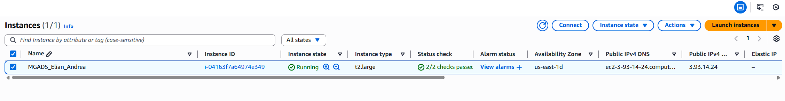
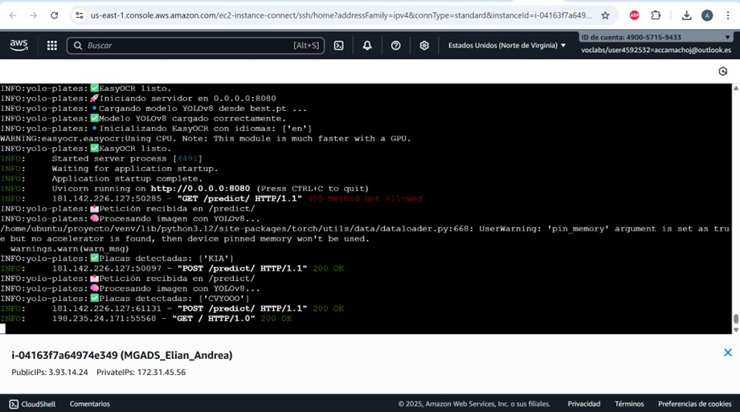
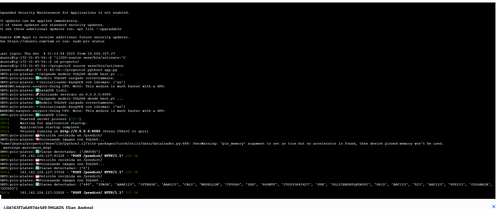
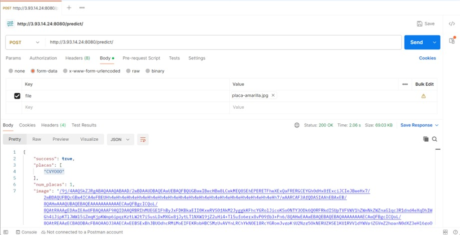
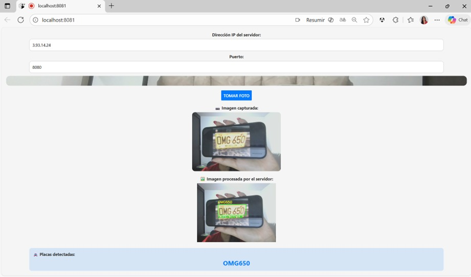
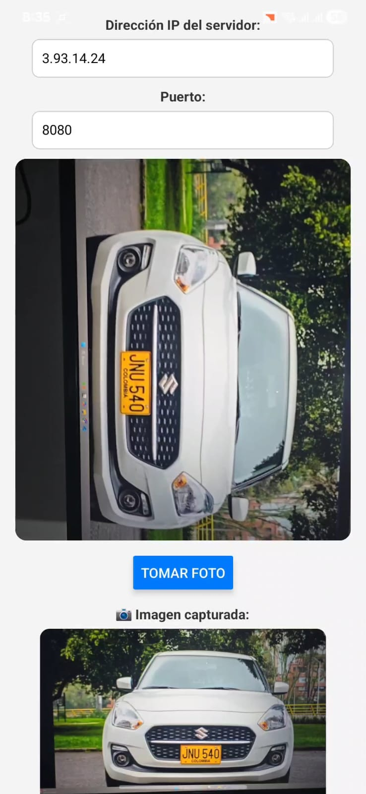
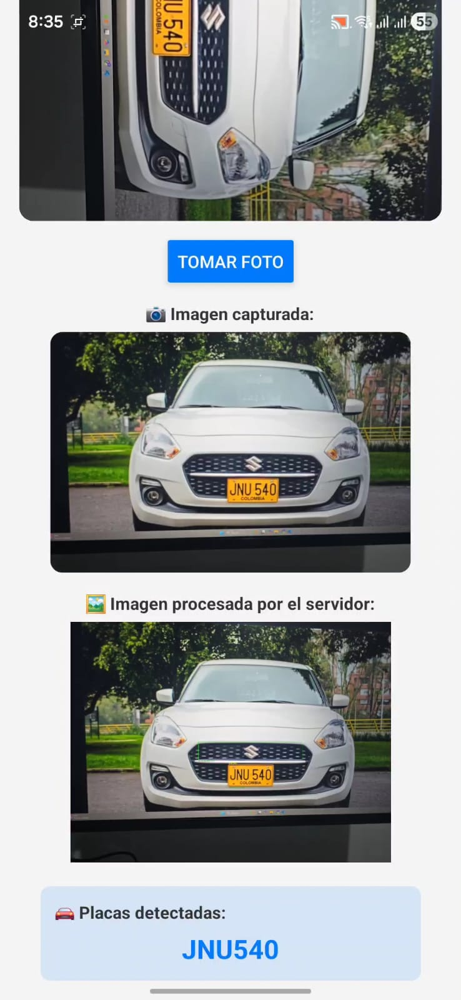

# Taller: Detección y Reconocimiento de Placas con **YOLOv8 + FastAPI** (Backend) y **Expo** (Mobile)

- **Fecha:** 03/12/2025  
- **Autores:** Elian Gil Sierra · Andrea Camacho Julio  
- **Programa:** Maestría en Gestión, Aplicación y Desarrollo de Software  
- **Repositorio guía:** `adiacla/Deployment-Mobile-Yolo` (https://github.com/adiacla/Deployment-Mobile-Yolo)  
- **Descripción general:** En este taller construimos un prototipo que recibe una imagen desde una app móvil, detecta la placa vehicular con **YOLOv8**, aplica **OCR** para extraer el texto y expone el resultado a través de una API en **FastAPI**, consumida desde una app **Expo**.

---

## Tabla de contenido
1. [Objetivo](#objetivo)  
2. [Arquitectura y flujo](#arquitectura-y-flujo)  
3. [Requisitos previos](#requisitos-previos)  
4. [Backend: FastAPI en AWS EC2](#backend-fastapi-en-aws-ec2)  
5. [Pruebas del backend](#pruebas-del-backend)  
6. [Frontend: Expo (Mobile)](#frontend-expo-mobile)  
7. [Evidencias (capturas y videos)](#evidencias-capturas-y-videos)  
8. [Conclusiones](#conclusiones)  

---

## 🎯 Objetivo del taller
Construir y desplegar un prototipo funcional capaz de:

1. **Recibir una imagen** desde una app móvil.
2. **Detectar** la región de la placa vehicular usando **YOLOv8**.
3. **Reconocer los caracteres (OCR)** de la placa con **EasyOCR**.
4. **Exponer** el resultado en una API (**FastAPI**) y consumirlo desde el frontend (**Expo**).

✅ **Resultado esperado:** un endpoint `POST /predict/` que responda JSON con la predicción (placa) y, opcionalmente, datos adicionales (p. ej., imagen anotada / metadatos).

---

## Arquitectura y flujo

### Componentes
- **Backend (AWS EC2 + Ubuntu):** FastAPI + Uvicorn. Cargamos el modelo `best.pt` y procesamos imágenes con YOLOv8 + OCR.
- **Modelo:** YOLOv8 entrenado (transfer learning) empaquetado como `best.pt`.
- **Frontend (Expo):** capturamos o seleccionamos una imagen, la enviamos por `multipart/form-data` al endpoint y mostramos la placa estimada.

### Flujo
1. En la app capturamos una imagen (cámara/galería).
2. Enviamos la imagen al backend como `multipart/form-data`.
3. En el backend ejecutamos detección (YOLO) y luego OCR sobre el recorte.
4. Respondemos con JSON.
5. En la app mostramos el texto de la placa (y, si aplica, lo reproducimos con voz).

---

## Requisitos previos

### Backend (AWS / Linux)
- Cuenta de AWS.
- Acceso a una instancia **EC2** con Ubuntu.
- **Security Group** configurado con:
  - SSH (22) para administración.
  - Puerto del API (ej. **8080**) abierto para pruebas externas.

### Frontend (Windows 11)
- **Node.js LTS** (recomendado Node 18+).
- Expo CLI / EAS CLI.
- App **Expo Go** en el dispositivo (Android o iOS).


---

## Backend: FastAPI en AWS EC2

### 1) Crear y configurar la instancia EC2
Realizamos los siguientes pasos:

- Creamos una instancia Ubuntu.
- Aumentamos el disco (recomendado **32 GiB** o más).
- Configuramos el Security Group y abrimos el puerto del API (ej. `8080`).
- Registramos la **IP pública** o **DNS público** para consumir el endpoint desde el móvil.



---

### 2) Conectarnos a la instancia
Nos conectamos por consola web o por SSH:

```bash
ssh -i "tu_clave.pem" ubuntu@<TU_IP_O_DNS>
```

Evidencia:



---

### 3) Preparar entorno y dependencias
En la instancia instalamos dependencias del sistema y preparamos un entorno virtual:

```bash
sudo apt update
sudo apt install -y python3-pip python3-venv libgl1 libglib2.0-0

mkdir -p proyecto
cd proyecto
python3 -m venv venv
source venv/bin/activate
```

Luego instalamos librerías (ejecución en CPU):

```bash
pip install --upgrade pip
pip install torch torchvision torchaudio --index-url https://download.pytorch.org/whl/cpu
pip install ultralytics fastapi uvicorn easyocr opencv-python-headless pillow numpy python-multipart
yolo check
```

> Nota: si el gestor de dependencias resuelve `numpy` 2.x y aparece un conflicto con `ultralytics`, fijamos `numpy<2` y reinstalamos.

---

### 4) Subir el modelo y los archivos al servidor
Desde nuestro equipo subimos el modelo y el backend con `scp`:

```bash
scp -i "tu_clave.pem" best.pt app.py ubuntu@<DNS_PUBLICO>:/home/ubuntu/proyecto/
```

---

### 5) Backend (`app.py`)
En `app.py` implementamos el endpoint que:

- Carga `best.pt` al iniciar.
- Recibe la imagen por `UploadFile`.
- Ejecuta YOLOv8 para localizar la placa.
- Aplica OCR sobre la región detectada.
- Devuelve la respuesta en JSON.

---

### 6) Ejecutar el backend
Con el entorno virtual activo, iniciamos el servidor:

```bash
source venv/bin/activate
uvicorn app:app --host 0.0.0.0 --port 8080
```

Evidencia:



---

## Pruebas del Backend

### Prueba con cURL
Verificamos el endpoint con una imagen de prueba:

```bash
curl -X POST -F "file=@image.jpg" http://<TU_IP_O_DNS>:8080/predict/
```

Evidencia:



---

## Frontend: Expo (Mobile)

### 1) Instalar herramientas
Validamos versiones de Node y npm:

```bash
node -v
npm -v
```

Instalamos Expo CLI y EAS CLI, y verificamos:

```bash
npm install -g expo-cli eas-cli
npx expo --version
eas --version
```

---

### 2) Crear el proyecto e instalar dependencias
Creamos el proyecto con TypeScript:

```bash
npx create-expo-app DetectorPlacas --template expo-template-blank-typescript
cd DetectorPlacas
```

Instalamos dependencias usadas en el taller:

```bash
npx expo install expo-camera expo-speech expo-image-manipulator
npx expo install expo-router expo-splash-screen expo-build-properties
npm install axios
```

---

### 3) Integrar el código y configurar el endpoint
Integramos el código base del repositorio en:

- `app/index.tsx`
- `app.json`

Finalmente, configuramos la URL del endpoint:

- `http://<IP_PUBLICA_EC2>:8080/predict/`

---

### 4) Ejecutar en desarrollo
Para pruebas en web:

```bash
npx expo start --web
```

Para probar en dispositivo con Expo Go:

```bash
npx expo start -c
```

Luego:

- Abrimos el Metro Bundler.
- Escaneamos el QR con Expo Go.
- Nos aseguramos de tener el celular y el PC en la misma red (Wi‑Fi).

Evidencia:



---

## Evidencias (capturas y videos)

### Evidencia 1: Flujo end-to-end (capturas)
Tomamos foto desde la app → el backend responde → la app muestra la placa detectada.

  


### Evidencia 2: Videos demostrativos
- 🎥 **Video 1 (demo en tiempo real):** [Ver video](https://drive.google.com/file/d/1bwG7Izjswkc7FpH6y6ZMQlhyCw2RxWjC/view?usp=sharing)  
- 🎥 **Video 2 (demo en tiempo real):** [Ver video](https://drive.google.com/file/d/1AOZb-ksUMj1-MagEXkhFRP-kVTWLJVGB/view?usp=sharing)  

---

## Conclusiones
- **Qué logramos:** desplegamos un prototipo funcional que integra detección de placas con YOLOv8, reconocimiento de caracteres con OCR y consumo desde una app Expo, validando el flujo completo de captura → inferencia → respuesta → visualización.
- **Qué aprendimos:** reforzamos el proceso de despliegue práctico en EC2 (entorno Python, dependencias, apertura de puertos, ejecución con Uvicorn) y la integración móvil (cámara/galería, envío `multipart/form-data` y presentación del resultado).
- **Siguientes pasos (mejoras):**
  - Robustecer el OCR (normalización, reglas/regex por país, manejo de baja iluminación).
  - Incorporar umbrales de confianza y estrategias de *fallback* cuando la detección sea ambigua.
  - Persistir resultados (SQLite/PostgreSQL) con timestamp y evidencias.
  - Optimizar inferencia (modelo más liviano, cuantización, recorte inteligente, batching).
  - Endurecer seguridad: autenticación, rate limiting, CORS estricto, y trazabilidad (logs/metrics).

---
